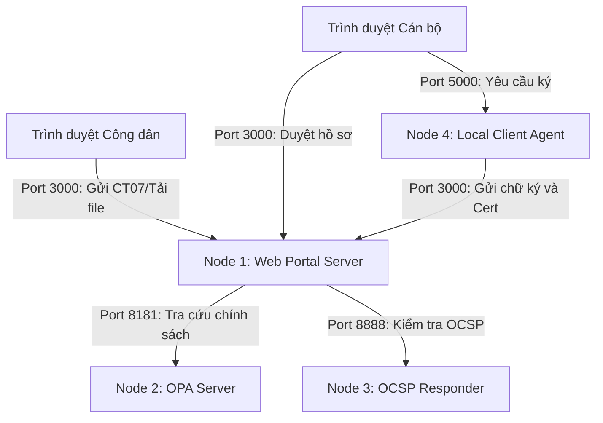

# Hướng dẫn Triển khai Hệ thống Ký số trên các Node Mạng (Không dùng Docker)

Tài liệu này hướng dẫn chi tiết cách triển khai và cấu hình các thành phần của hệ thống ký số hai lớp (Local Agent & Remote HSM) trực tiếp trên các node mạng vật lý hoặc máy ảo (VM) chạy hệ điều hành Linux hoặc Windows mà không sử dụng Docker.

---

## 1. Kiến trúc Triển khai (Multi-Node Architecture)

Hệ thống bao gồm 4 thành phần chính được chạy trên các node mạng độc lập hoặc dùng chung (cấu hình qua địa chỉ IP):



1. **Node 1: Web Portal Server (Node.js & Python)**
   - Đóng vai trò là máy chủ ứng dụng chính, quản lý hồ sơ, lưu trữ keystore, CA và tích hợp chữ ký số vào văn bản PDF.
   - Chạy trên cổng mặc định: `3000`.
2. **Node 2: OPA Policy Engine (Open Policy Agent)**
   - Máy chủ kiểm soát truy cập và chính sách phê duyệt/ký số qua Rego.
   - Chạy trên cổng mặc định: `8181`.
3. **Node 3: OCSP Responder (OpenSSL)**
   - Trình xác thực trạng thái thu hồi chứng thư số thời gian thực.
   - Chạy trên cổng mặc định: `8888`.
4. **Node 4: Local Client Agent (Python Flask & Tkinter)**
   - Chạy trực tiếp trên máy tính cá nhân của Cán bộ / Công dân có nhu cầu ký số bằng chứng thư ảo PKCS#12 (.p12).
   - Chạy trên cổng mặc định: `5000`.

---

## 2. Cài đặt các Tiền đề (Prerequisites)

### Trên các máy Linux (Debian/Ubuntu):
Chạy lệnh sau để cài đặt Node.js, Python, OpenSSL và SoftHSM2:
```bash
sudo apt-get update
sudo apt-get install -y nodejs npm python3 python3-pip python3-venv openssl softhsm2 opensc
```

### Trên máy Windows (Dành cho Client hoặc Server):
1. **Node.js**: Tải và cài đặt phiên bản LTS từ [nodejs.org](https://nodejs.org/).
2. **Python 3**: Tải và cài đặt từ [python.org](https://python.org/) (nhớ tích chọn "Add Python to PATH").
3. **OpenSSL**: Tải và cài đặt phiên bản OpenSSL cho Windows (ví dụ từ Win32 OpenSSL) và thêm thư mục `bin` vào PATH hệ thống.

---

## 3. Các bước Triển khai từng Node Mạng

### Node 2: Triển khai OPA Policy Engine
1. Tải OPA binary phù hợp với hệ điều hành:
   - **Linux**:
     ```bash
     curl -L -o opa https://openpolicyagent.org/downloads/v0.61.0/opa_linux_amd64_static
     chmod +x opa
     sudo mv opa /usr/local/bin/
     ```
   - **Windows**: Tải file `.exe` từ trang chủ OPA và thêm vào PATH.
2. Di chuyển vào thư mục dự án và chạy OPA Server với thư mục chính sách `portal/policies`:
   ```bash
   # Chạy OPA server trên cổng 8181 lắng nghe mọi IP
   opa run --server --addr=0.0.0.0:8181 ./portal/policies
   ```

### Node 3: Triển khai OCSP Responder
OCSP Responder sử dụng OpenSSL để kiểm tra trạng thái chứng chỉ dựa trên tệp chỉ mục `index.txt` được cập nhật bởi Portal Server.
1. Di chuyển vào thư mục hạ tầng dự án:
   - **Trên Linux**: Chạy script khởi động:
     ```bash
     chmod +x ca-infrastructure/ocsp/start-ocsp.sh
     ./ca-infrastructure/ocsp/start-ocsp.sh
     ```
   - **Trên Windows**: Chạy file batch:
     ```cmd
     double-click hoặc chạy lệnh: .\ca-infrastructure\ocsp\start-ocsp.bat
     ```

### Node 1: Triển khai Web Portal Server
1. Cài đặt các thư viện Node.js:
   ```bash
   cd portal/backend
   npm install
   ```
2. Cài đặt môi trường Python ảo và các thư viện ký PDF (PyHanko):
   - **Trên Linux**:
     ```bash
     python3 -m venv venv
     source venv/bin/activate
     pip3 install -r ../../tsp/python_core/requirements.txt
     ```
   - **Trên Windows**:
     ```cmd
     python -m venv venv
     .\venv\Scripts\activate
     pip install -r ..\..\tsp/python_core/requirements.txt
     ```
3. Cấu hình biến môi trường và khởi chạy Server:
    - **Cấu hình OPA Node IP**: Thiết lập biến môi trường `OPA_URL` trỏ tới IP của Node 2 (Ví dụ: `192.168.1.102`):
      - **Linux**: `export OPA_URL=http://192.168.1.102:8181`
      - **Windows**: `set OPA_URL=http://192.168.1.102:8181`
   - **Khởi chạy**:
     ```bash
     node server.js
     ```
     Server sẽ tự động sinh chứng chỉ SSL/TLS Self-Signed và chạy tại địa chỉ: https://localhost:3000.

### Node 4: Triển khai Local Client Agent (Dành cho Cán bộ)
Agent chạy trực tiếp trên máy của người ký để truy cập vào Token ảo (.p12).
1. Di chuyển vào thư mục `client-agents`:
   ```bash
   cd client-agents
   ```
2. Cài đặt các thư viện Python cần thiết:
   ```bash
   pip install flask flask-cors requests cryptography tkinter
   ```
3. Cấu hình địa chỉ IP của Web Portal Server:
   Thiết lập biến môi trường `PORTAL_URL` chỉ tới IP của Node 1 (Ví dụ: `192.168.1.100`):
   - **Linux**: `export PORTAL_URL=https://192.168.1.100:3000`
   - **Windows**: `set PORTAL_URL=https://192.168.1.100:3000`
4. Khởi chạy Agent:
   ```bash
   python agent.py
   ```
   *Lưu ý:* Khi khởi chạy, một cửa sổ popup sẽ xuất hiện yêu cầu chọn tệp chữ ký ảo `.p12` của Cán bộ (tải về từ trang portal cán bộ).

## 4. Kiểm tra Kết quả Ký số (Nhận 2 File)

Khi Cán bộ duyệt và thực hiện ký số hồ sơ CT07 thành công (ký Local hoặc Remote qua HSM):
1. Đăng nhập vào cổng dịch vụ công của công dân.
2. Tại bảng **Hồ sơ của tôi**, các hồ sơ có trạng thái **Đã ký số** sẽ xuất hiện 2 liên kết tải xuống độc lập:
   - **PDF đã ký**: File tài liệu PDF gốc kèm chữ ký số tích hợp và dấu dấu xác thực hiển thị đẹp mắt (xem được tích xanh trên Adobe Acrobat).
   - **Chữ ký rời (.sig)**: File văn bản thô chứa chuỗi chữ ký Base64 thô đã được ký bằng khóa riêng, nhằm mục đích gửi lên hệ thống của cơ quan thuế hoặc đối tác.

---

## 5. Hướng dẫn Triển khai Cloud Native (AWS / GCP / Azure)

> [!TIP]
> Để triển khai nhanh chóng lên Cloud miễn phí và cấu hình chứng chỉ HTTPS hợp lệ (xanh lá) bằng Let's Encrypt mà không mất phí mua tên miền, hãy xem tài liệu hướng dẫn chi tiết từng bước tại: [CLOUD_DEPLOYMENT_HTTPS.md](file:///c:/Avalon/Code/NT219 Project/Do_An_MMH/Do_An_MMH/CLOUD_DEPLOYMENT_HTTPS.md).

Đối với các nhà cung cấp đám mây lớn (AWS, GCP, Azure), bạn có thể triển khai hệ thống trên các máy ảo (Virtual Machines - EC2/Compute Engine) mà không cần Docker. Dưới đây là các bước triển khai chi tiết:

### A. Khởi tạo Hạ tầng bằng Terraform (Ví dụ trên AWS)
Tôi đã cấu hình sẵn tệp tin [main.tf](file:///c:/Avalon/Code/NT219 Project/Do_An_MMH/Do_An_MMH/terraform/main.tf) để tự động khởi tạo hệ thống trên AWS:
1. Đảm bảo bạn đã cài đặt **Terraform CLI** và cấu hình **AWS credentials** (`aws configure`).
2. Khởi tạo thư mục Terraform:
   ```bash
   cd terraform
   terraform init
   ```
3. Tạo và kiểm tra tài nguyên ảo (VPC, Subnets, Security Groups, EC2):
   ```bash
   terraform plan -var="key_pair_name=ten_key_cua_ban"
   ```
4. Áp dụng triển khai tài nguyên lên đám mây AWS:
   ```bash
   terraform apply -var="key_pair_name=ten_key_cua_ban"
   ```
   *Sau khi chạy xong, Terraform sẽ in ra Public IP của Portal Server, Private IP của OPA, và Public IP của OCSP.*

### B. Vận hành Không dùng Docker (Sử dụng PM2 và Systemd)
Để đảm bảo các dịch vụ chạy ngầm bền bỉ (auto-restart) trên máy chủ ảo đám mây Linux:
1. **Dịch vụ Web Portal**:
   - Cài đặt PM2 (Process Manager cho Node.js):
     ```bash
     sudo npm install -g pm2
     ```
   - Chạy ứng dụng dưới sự quản lý của PM2:
     ```bash
     # Thiết lập biến môi trường và chạy
     OPA_URL="http://[OPA_PRIVATE_IP]:8181" pm2 start server.js --name "nt219-portal"
     pm2 startup
     pm2 save
     ```
2. **Dịch vụ OPA Policy Engine**:
   - Cấu hình OPA chạy như một dịch vụ Systemd bằng cách tạo tệp `/etc/systemd/system/opa.service`:
     ```ini
     [Unit]
     Description=Open Policy Agent Service
     After=network.target

     [Service]
     Type=simple
     ExecStart=/usr/local/bin/opa run --server --addr=0.0.0.0:8181 /home/ubuntu/Do_An_MMH/portal/policies
     Restart=on-failure

     [Install]
     WantedBy=multi-user.target
     ```
   - Kích hoạt dịch vụ OPA:
     ```bash
     sudo systemctl daemon-reload
     sudo systemctl enable opa
     sudo systemctl start opa
     ```
3. **Dịch vụ OCSP Responder**:
   - Cấu hình OCSP Responder chạy qua Systemd bằng cách tạo tệp `/etc/systemd/system/ocsp.service`:
     ```ini
     [Unit]
     Description=OpenSSL OCSP Responder
     After=network.target

     [Service]
     Type=simple
     WorkingDirectory=/home/ubuntu/Do_An_MMH
     ExecStart=/bin/bash /home/ubuntu/Do_An_MMH/ca-infrastructure/ocsp/start-ocsp.sh
     Restart=on-failure

     [Install]
     WantedBy=multi-user.target
     ```
   - Kích hoạt dịch vụ OCSP:
     ```bash
     sudo systemctl daemon-reload
     sudo systemctl enable ocsp
     sudo systemctl start ocsp
     ```

### C. Cấu hình bảo mật Tường lửa mạng (Network Security)
Đảm bảo bạn đã cấu hình chính xác **Security Groups** (đối với AWS) hoặc **Firewall Rules** (đối với GCP/Azure):
- **Web Portal Server**: Mở cổng **3000** ra Internet công cộng để Công dân và Cán bộ truy cập.
- **OPA Server**: Mở cổng **8181** **chỉ** chấp nhận lưu lượng đến từ IP nội bộ (Private IP) của Portal Server. Khóa cổng này khỏi Internet để tránh rò rỉ chính sách.
- **OCSP Server**: Mở cổng **8888** ra Internet công cộng để các ứng dụng đối tác bên ngoài có thể gửi yêu cầu xác minh chứng thư số.
