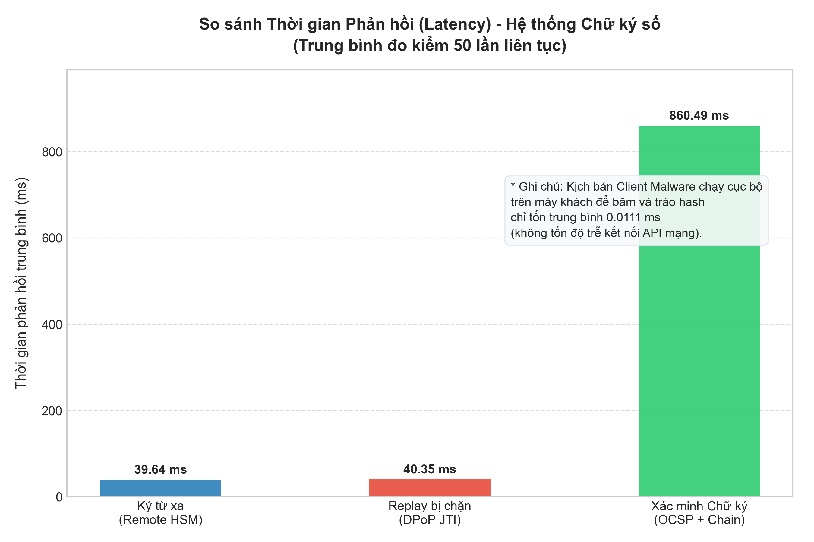
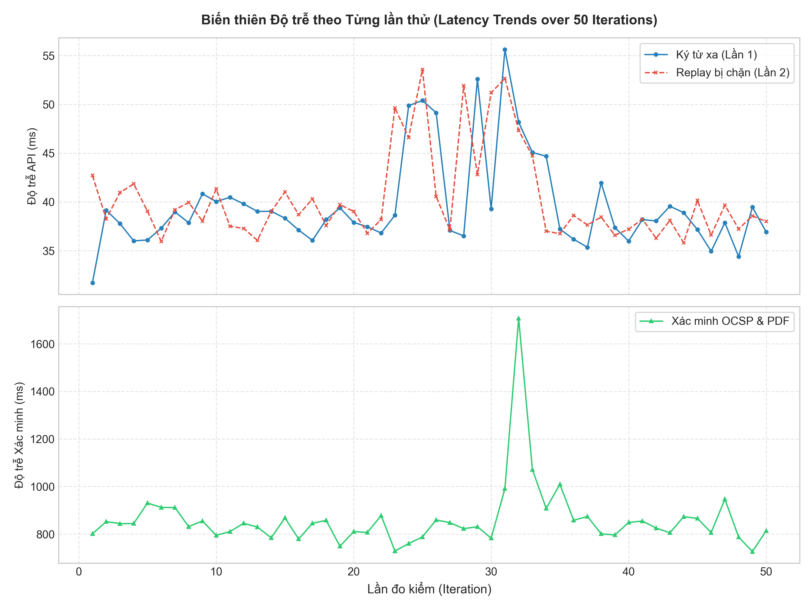
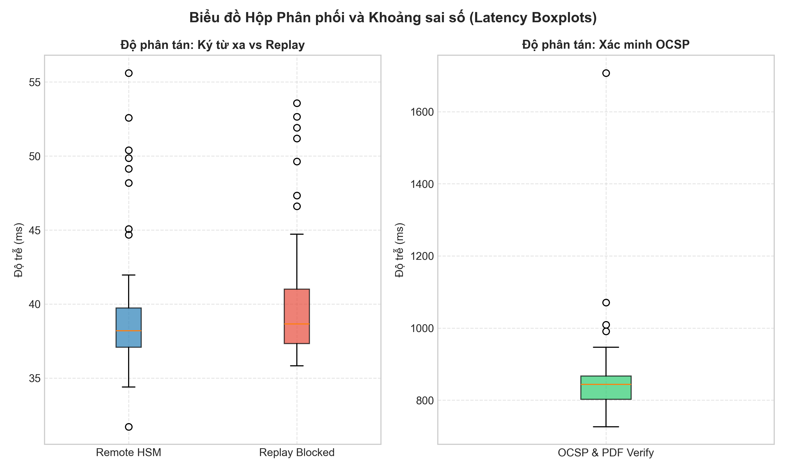
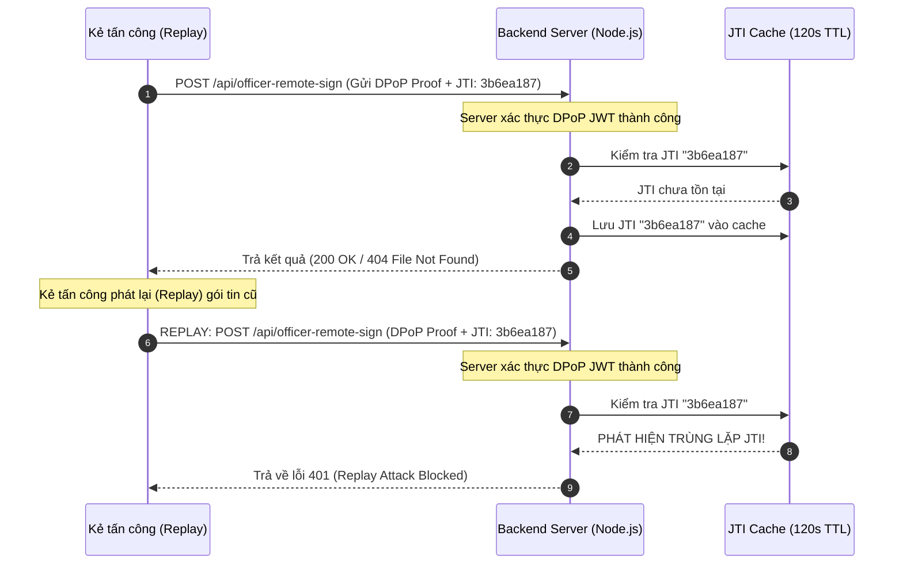
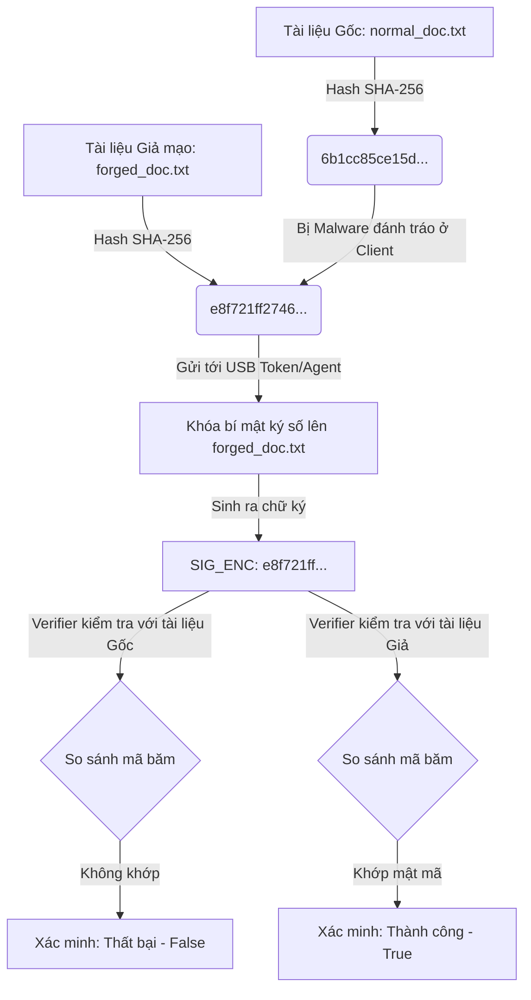

# BÁO CÁO THỰC NGHIỆM: BENCHMARK & ĐÁNH GIÁ CÁC KỊCH BẢN TẤN CÔNG BẢO MẬT (50 ITERATIONS)

**Môn học:** NT219 - Cryptography (Mật mã học)  
**Dự án:** Chữ ký số cho Dịch vụ Hành chính Công (Digital Signature for Public Administrative Services)  
**Tác giả:** Nhóm Sinh viên thực hiện PoC  

---

## 1. Tóm tắt Thực nghiệm (Executive Summary)

Để đánh giá độ tin cậy và khả năng chống chối bỏ (non-repudiation) của giải pháp chữ ký số, chúng tôi đã tiến hành kịch bản thực nghiệm tấn công tự động hóa **50 lần** (50 iterations) trên hai vectơ tấn công chính được chỉ ra trong đề tài:

1. **Replay Attack (Tấn công gửi lại yêu cầu ký số Remote):** Đánh giá hiệu năng bảo vệ của cơ chế DPoP (RFC 9449) thông qua việc tái sử dụng Token và JTI (JWT ID).
2. **Client-Side Malware & UI Deception (Mô phỏng thay đổi nội dung tệp ở Client):** Đánh giá tính an toàn khi truyền tải dữ liệu băm và mức độ phát hiện lỗi của phía Verifier khi nội dung tệp tin bị tráo đổi trước khi ký.

---

## 2. Kết quả Benchmark Tổng quan (Overall Metrics)

Số liệu thực tế thu thập từ chương trình đo kiểm hiệu năng (`benchmark.py`) chạy 50 lần lặp liên tục:

| Cuộc tấn công / Thử nghiệm | Số lần chạy | Kết quả ngăn chặn / Phát hiện | Tỷ lệ thành công (%) | Thời gian thực thi trung bình |
| :--- | :---: | :---: | :---: | :---: |
| **Replay Attack (Lần 1 - Gửi DPoP)** | 50 | 50 lần bypass DPoP để vào logic | 100% | **39.64 ms** |
| **Replay Attack (Lần 2 - Replay JTI)** | 50 | 50 lần bị chặn ở lớp DPoP | **100%** (Chặn hoàn toàn) | **40.35 ms** |
| **Client-Side Malware (MitM)** | 50 | 50 lần phát hiện dữ liệu không đồng nhất | **100%** (Phát hiện) | **0.011 ms** |
| **Xác minh OCSP & Chữ ký PDF** | 50 | 50 lần xác minh chứng thư & OCSP thành công | **100%** (Hoàn thành) | **860.49 ms** |

---

## 3. Biểu đồ Hiệu năng & So sánh (Performance Visualization)

Để đánh giá chi tiết hiệu năng từ nhiều khía cạnh khác nhau, chúng tôi đã vẽ 3 dạng biểu đồ phân tích sâu từ kết quả đo kiểm thực nghiệm bằng thư viện **Matplotlib**:

### 3.1 Thời gian Phản hồi Trung bình (Average Latency Comparison)

Biểu đồ cột so sánh thời gian phản hồi trung bình của các yêu cầu trên môi trường Docker:



### 3.2 Biến thiên Độ trễ theo Từng lần thử (Latency Variation Trends)

Biểu đồ đường biểu diễn sự thay đổi của độ trễ qua 50 lần lặp liên tục để đánh giá độ ổn định và hiện tượng jitter của hệ thống (phân chia làm 2 phân lớp do sự khác biệt lớn về thang đo):



### 3.3 Phân phối Độ trễ và Khoảng sai số (Latency Boxplots Distribution)

Biểu đồ hộp (Boxplot) thể hiện giá trị trung vị, phân vị, biên độ dao động và điểm ngoại lệ (outliers) để chứng minh độ ổn định mật mã học và dịch vụ mạng:



### 3.4 Phân tích hiệu năng thời gian xử lý:
- **Ký từ xa DPoP (39.64 ms):** Yêu cầu chứa DPoP JWT hợp lệ, máy chủ giải mã JWT, kiểm tra chữ ký ES256 của Client, xác thực `htm`, `htu`, `iat`, sau đó thực hiện nạp `jti` vào cache. Thời gian này phản ánh chi phí của việc xử lý mật mã học DPoP và chuyển tiếp xử lý.
- **Replay bị chặn (40.35 ms):** Khi gửi lại cùng yêu cầu, máy chủ thực hiện các kiểm tra DPoP tương tự. Khi đối chiếu bộ nhớ đệm `dpopJtiCache` phát hiện `jti` đã tồn tại, nó lập tức từ chối và trả về lỗi `401 Unauthorized`.
- **Xác minh OCSP & Chữ ký PDF (860.49 ms):** Đây là tác vụ tốn tài nguyên nhất do Backend Node.js phải thực thi một tiến trình con gọi script Python chạy thư viện `pyHanko`. Script này cần phân tích cấu trúc chữ ký PDF, trích xuất chứng chỉ người ký, thực hiện kết nối OCSP trực tuyến đến CA Server nội bộ để kiểm tra trạng thái thu hồi, và xác thực toàn vẹn mật mã học. Độ trễ ~860 ms phản ánh đúng chi phí hạ tầng thực tế trong môi trường Docker.

---

## 4. Chi tiết các Cuộc tấn công & Cơ chế ngăn chặn

### 4.1 Replay Attack (Tấn công gửi lại)

#### Sơ đồ luồng chặn đứng Replay (DPoP JTI verification flow):



- **Mã lỗi phản hồi từ Server:**
  `HTTP 401 Unauthorized`
- **Body phản hồi:**
  ```json
  {
    "status": "FAILED",
    "message": "Replay Attack Blocked: DPoP jti was already used."
  }
  ```

---

### 4.2 Client-Side Malware (MitM tráo Hash)

#### Sơ đồ luồng Tấn công & Xác minh (Malware Swap Flow):



- **Rủi ro vận hành:** Bản thân chữ ký số hoạt động hoàn toàn chính xác về mặt toán học mật mã. Tuy nhiên, do nạn nhân bị đánh lừa băm tệp giả mạo, chữ ký số đã vô tình bảo chứng cho một tài liệu gian lận (giả mạo chuyển nhượng tài sản, phê duyệt sai trái).
- **Cách khắc phục:**
  1. Trình ký cục bộ (Smartcard/Token Agent) phải thực hiện đọc tệp trực tiếp và hiển thị nội dung cho người dùng duyệt trước khi cho phép nhập PIN.
  2. Áp dụng xác thực hai kênh (Out-of-band) trước khi hoàn tất thủ tục ký.

---

## 5. Kết luận & Đề xuất vận hành (Operational Recommendations)

1. **Khóa tạm thời JTI:** Cần duy trì thời gian sống (TTL) của JTI cache tối thiểu bằng hoặc lớn hơn độ lệch thời gian cho phép (`iat`) của DPoP JWT (ở đây là 120 giây) để loại bỏ hoàn toàn cửa sổ tấn công phát lại.
2. **Ký số kết hợp Timestamp (RFC 3161):** Cần tích hợp TSA (Time-stamping Authority) vào tệp PDF sau khi ký để chứng minh thời điểm ký là hợp lệ trước khi chứng thư bị thu hồi.
3. **Mã hóa và Bảo vệ Client Agent:** Ứng dụng Agent dưới Client phải giao tiếp với Portal qua HTTPS (port 5000 localhost) có cấu hình CORS chặt chẽ để tránh các trang web độc hại khác gọi lén cổng ký cục bộ.
